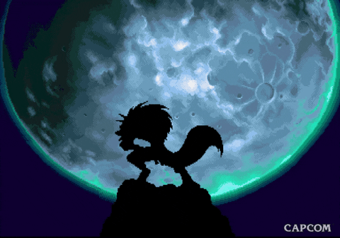

There is a widely held belief that police are busier during a full moon.  Why do people believe this? Perhaps the gravitational forces of the full moon cause cyclic fluid shifts between body compartments and thereby trigger emotional disturbances leading to more aggressive and erratic behaviors.^[https://bmjopen.bmj.com/content/9/1/e022759] Or perhaps there is a scintilla of truth to the mythology of the ancient Greeks and Romans and humans actually turn into wolves during the full moon....or at least channel something wild within.




```{r setup, include=FALSE, echo = FALSE}

library("tidyverse")
library("lubridate")
library("plotly")
library(readxl)
library(covdataplot)
library(magick)
library(extrafont)
library(sf)
library(ggmap)
library(gganimate)
library(ggpubr)

#Load weather data summary from NOAA
weather <- read_excel("temperature_data.xlsx") |>
  #filter(year(ymd(DATE))== '2017') |>
  filter(grepl("CINCINNATI NORTHERN", NAME)) |>
  select(where(~!all(is.na(.x)))) |>
  mutate(DATE = as.character(DATE)) |>
  select(DATE, TMAX)

## Get moon cycle data from https://www.timeanddate.com/moon/phases/usa/cincinnati
moon_cycles <- read_excel("moon_cycles_2016_2022.xlsx", sheet = 1, 
                          col_names = TRUE)

moon_cycles <- moon_cycles |>
  pivot_longer(!c(Lunation, Year), names_to = "moon_cycles", values_to = "date") |>
  filter(!is.na(date)) |>
  mutate(date = str_remove(date, "^\\d{4}-")) |>
  mutate(date = paste(Year, date, sep = "-")) |>
  mutate(date = ymd(date)) |>
  mutate(date = as.character(date))


##Get police run data
police_runs <- readRDS("police_runs_2016_2022.rds")


## Combine all data
runs_moons_temp <- police_runs |>
  mutate(date = format(strptime(DisptachedTime1, format='%Y-%m-%d %H:%M:%S'), '%Y-%m-%d')) |>
  group_by(date) |>
  summarize(Count = n()) |>
  left_join(moon_cycles)|>
  mutate(`Moon Phase` = lag(moon_cycles)) |>
  mutate(`Moon Phase` = ifelse(is.na(`Moon Phase`), moon_cycles, `Moon Phase`)) |>
  mutate(`Moon Phase` = case_when(`Moon Phase` %in% c("New_Moon") ~ "New Moon",
                                   `Moon Phase` %in% c("First_Quarter") ~ "First Quarter",
                                   `Moon Phase` %in% c("Full_Moon") ~ "Full Moon",
                                   `Moon Phase` %in% c("Third_Quarter") ~ "Third Quarter",
                                   is.na(`Moon Phase`) ~ "Between Phases"),
  `Moon Phase` = factor(`Moon Phase`, levels = c("New Moon", "First Quarter",
                                                     "Full Moon", "Third Quarter", "Between Phases")),
  Year = year(ymd(date)),
  Month = month(ymd(date)),
          Season = case_when(Month %in% c(3, 4, 5) ~ "Spring",
                            Month %in% c(6, 7, 8) ~ "Summer",
                            Month %in% c(9, 10, 11) ~ "Fall",
                            Month %in% c(12, 1 ,2) ~ "Winter")) |>
  mutate(Season = fct_relevel(Season, "Summer", "Fall", "Winter","Spring")) |>
  
  left_join(weather, by = c("date"="DATE")) |>
  rename(CFS = Count)
  


```


# Moon Phase

Meritless lore, or something more? Whatever the case, the myth does not hold up well in Covington as the data show that Police are not busier during a full moon. The chart below shows that, on average, the Covington Police do not respond to more calls when there is a full moon compared to other days. For this post we compared the average daily number of calls received for police service over the period 2019-2022 during the four moon phases (New Moon, First Quarter, Full Moon, Third Quarter) and the days between each phase.       


```{r eval=TRUE, echo = FALSE, message = FALSE, warning= FALSE}

bar_plot_labels <-  labs( 
       y = "Temperature °C \n", 
       title = "Average Daily Calls for Police Service",
       subtitle = "Moon Phases: 2019-2022\n",
       caption = "Police Department\nCity of Covington\n CovData | 2023")
  
moon_colors <- c("#cccccc", "#FB9A99", "#ea0029", "#6A3D9A", "#33A02C")

#bar chart(s) for moon cycles and cfs
runs_moons_temp_bar <- runs_moons_temp |>
  filter(!is.na(`Moon Phase`)) |>
  count(`Moon Phase`,  wt = round(mean(CFS),1), name = "Calls for Service") |>
  ggplot(aes(`Moon Phase`, `Calls for Service`, fill = `Moon Phase`))+
  geom_bar(stat = 'identity', position = "dodge", color = covdata_color("covington.black"), show.legend = FALSE)+
  bar_plot_labels +
  scale_fill_manual(values = moon_colors)+
  #covdata_fill_d("Paired")+
  scale_y_continuous(label=scales::label_number_si(),
                     expand = expansion(mult = c(0, .1)), limits = c(0, 125), n.breaks = 6)+
  
  geom_text(aes(label = scales::comma(`Calls for Service`)), vjust = -0.5, position = position_dodge(0.9),
            size = 3.0)+
  #facet_wrap(~Season, nrow = 1)+
  covdata_theme()
 
covdata_plot(runs_moons_temp_bar, "cov.logo.blue")


```

```{r eval=FALSE, echo = FALSE, message = FALSE, warning= FALSE, fig.width= 6, fig.height=4}

bar_plot_labels <-  labs( 
       y = "Temperature °C \n", 
       title = "Average Daily Calls for Police Service",
       subtitle = "Moon Phases: 2019-2022\n",
       caption = "Police Department\nCity of Covington\n CovData | 2023")
  
moon_colors <- c("#cccccc", "#FB9A99", "#ea0029", "#6A3D9A", "#33A02C")

#bar chart(s) for moon cycles and cfs
runs_moons_temp_facet <- runs_moons_temp |>
  filter(!is.na(`Moon Phase`)) |>
  count(`Moon Phase`, Season, wt = round(mean(CFS),0), name = "Calls for Service") |>
  ggplot(aes(`Moon Phase`, `Calls for Service`, fill = `Moon Phase`))+
  geom_bar(stat = 'identity', position = "dodge")+
  bar_plot_labels +
  scale_fill_manual(values = moon_colors)+
  #covdata_fill_d("Paired")+
  scale_y_continuous(label=scales::label_number_si(),
                     expand = expansion(mult = c(0, .1)), limits = c(0, 125), n.breaks = 6)+
  
  geom_text(aes(label = scales::comma(`Calls for Service`)), vjust = -0.5, position = position_dodge(0.9),
            size = 3.0)+
  facet_wrap(~Season, nrow = 1)+
  covdata_theme()+
  theme(axis.text.x = element_blank(),
        axis.ticks.x = element_blank())

 
covdata_plot(runs_moons_temp_facet, "cov.logo.blue", save_name = "moon_temp")


```


# Temperature

What is important on the days when there is a full moon, however, is the temperature.  The scatter plot below shows the relationship between the average number of police calls received each day (y-axis) and the daily maximum temperature (x-axis) during the full moon phases.  The blue line, which illustrates the relationship, shows that on warmer full-moon days the Covington Police tend to receive more calls for service.^[The R value of 0.58 displayed in the upper left corner of the graph tells us that there is a moderate association between calls for service and maximum daily temperature]

```{r eval=TRUE, echo = FALSE, message = FALSE, warning= FALSE, fig.height = 6}

##  daily max temperature and cfs
scat_plot_labels <-  labs( 
       y = "Temperature °C \n", 
       title = "Average Daily Calls for Service and Daily Max Temperature (TMAX)",
       subtitle = "Full Moon Phase: 2019-2022\n",
       caption = "Police Department\nCity of Covington\n CovData | 2023")

  
moon_colors <- c("#ea0029")

#bar chart(s) for moon cycles and cfs
runs_moons_temp_scatr <- runs_moons_temp |>
  filter(`Moon Phase` == "Full Moon") |>
  #filter(Year == 2022) |>
  ggplot(aes(TMAX, CFS, color = `Moon Phase`)) +
  geom_point(show.legend = FALSE) +
  
  scat_plot_labels +
  scale_color_manual(values = moon_colors)+
  geom_smooth(method = "lm", color = "blue")+
  stat_cor(aes(label = ..r.label..), color = "black", method = "pearson", label.x = 3)+
  covdata_theme() +
  facet_wrap(~`Moon Phase`)


 
covdata_plot(runs_moons_temp_scatr, "cov.logo.blue")


```


