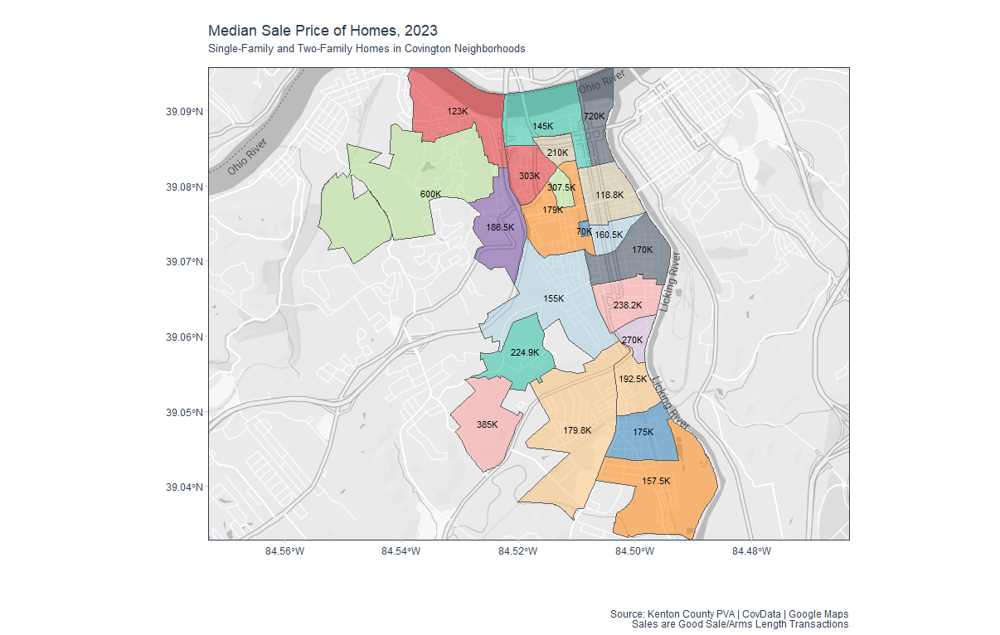

```{r setup, include=FALSE, echo = FALSE}

library("tidyverse")
library("lubridate")
library("plotly")
library(readxl)
library(covdataplot)
library(magick)
library(extrafont)
library(sf)
library(ggmap)
library(gganimate)
library(gghighlight)
library(scales)
library(tidyquant)

#Function to abbreviate dollar amounts and add symbol
covdata_comprss <- function(tx, label = FALSE) { 
  div <- findInterval(as.numeric(gsub("\\,", "", tx)), 
                      c(0, 1e3, 1e6, 1e9, 1e12) )  # modify this if negative numbers are possible
  if(label){
    paste(round( as.numeric(gsub("\\,","",tx))/10^(3*(div-1)), 0), 
          c("","K","M","B","T")[div], sep = "" )
  }
  else{
    paste(round( as.numeric(gsub("\\,","",tx))/10^(3*(div-1)), 1), 
          c("","K","M","B","T")[div], sep = "" )}
}

home_sales <- readRDS("cov_home_sales.rds")
neighborhoods <- readRDS("neighborhoods.rds")


```


What does a house cost in The Cov? 
 
Depends (greatly) on where you look.
 
With the affordability of housing a frequent topic of conversation these days, the City of Covington’s analytics manager took a dive into 2023 sales by neighborhood and found a wide range of prices, with a few outliers.
 
The median sales price in 13 of the 23 neighborhoods was less than $200,000.  In seven neighborhoods, it was $161,000 or less. And since these numbers reflect the “median” – not the “mean” (aka “average”) – that means that fully half of the homes in each neighborhood sold for less than the price listed on this map or in the bar graph. 
 
 


```{r eval=TRUE, warning = FALSE, echo = FALSE, message = FALSE, fig.height=6, fig.width=7}


#///////////////////////////
# Home Sales in Covington Neighborhoods ----
#///////////////////////////


home_sales_def <- home_sales %>%
  mutate_at(vars(RECD_DATE), mdy)%>%
  filter(LANDUSE_TE %in% c("SINGLE FAMILY", "TWO FAMILY") & !is.na(RECD_DATE))%>%
  st_as_sf(coords = c("long", "lat"), crs = 4326)%>%
  #st_join(neighborhoods, join = st_within)%>%
  filter(year(RECD_DATE) == 2023)


neigh_home_sales <-  home_sales_def%>%
  st_drop_geometry()
 
neigh_poly_map <- home_sales_def %>%
  mutate(lat = unlist(map(home_sales_def$geometry,2)),
         lon = unlist(map(home_sales_def$geometry, 1)))%>%
  st_drop_geometry()

### Sales price by Neighborhood
neigh_yearly_sales <- neigh_home_sales %>%
  count(NbhdLabel, year(RECD_DATE), wt = median(RECD_PRICE), name = "Median Sale Price")%>%
  rename(Year = `year(RECD_DATE)`)%>%
  mutate_at(vars(Year), as.character)

neighborhood_labels <- labs(title = "Median Sale Price of Homes, 2023",
       subtitle = "Single-Family and Two-Family Homes in Covington Neighborhoods\n",
       caption = "\nSource: Kenton County PVA | CovData\nSales are Good Sale/Arms Length Transactions",
       x = "", y = "") 

yearly_bar <- neigh_yearly_sales %>%
  ggplot(aes(x = NbhdLabel, y = `Median Sale Price`, fill = NbhdLabel))+
  geom_bar(stat = 'identity',position = "dodge", show.legend = FALSE)+
  #facet_wrap(~Employee_Name)+
  scale_color_tq() +
  scale_fill_tq() +
  covdata_theme()+
  theme_tq() +
  coord_flip() +
   scale_y_continuous(label=scales::label_number_si(),n.breaks = 9,
                     expand = expansion(mult = c(0, .1))) +
  geom_text(aes(label = scales::comma(`Median Sale Price`, accuracy = 1.0)), hjust= -0.1,  size = 3.0)+
  neighborhood_labels
  


covdata_plot(yearly_bar, "cov.logo.blue")
 


```



*(NOTE: Due to display challenges posed by Covington’s elongated vertical shape, South Covington is not listed on the map, although it is in the bar graph.)*  

