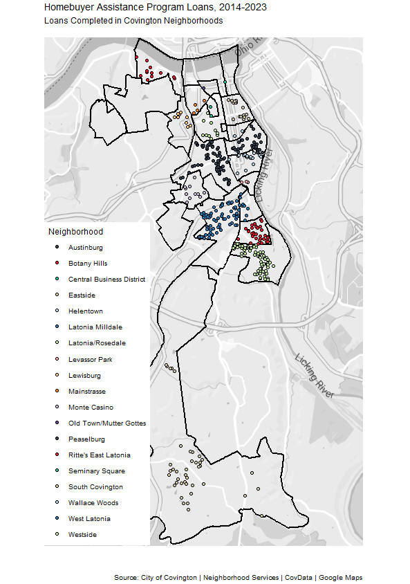

```{r setup, include=FALSE, echo = FALSE}

library("tidyverse")
library("lubridate")
library("plotly")
library(readxl)
library(covdataplot)
library(magick)
library(extrafont)
library(sf)
library(ggmap)
library(gganimate)
library(gghighlight)
library(scales)
library(tidyquant)

#Function to abbreviate dollar amounts and add symbol
covdata_comprss <- function(tx, label = FALSE) { 
  div <- findInterval(as.numeric(gsub("\\,", "", tx)), 
                      c(0, 1e3, 1e6, 1e9, 1e12) )  # modify this if negative numbers are possible
  if(label){
    paste(round( as.numeric(gsub("\\,","",tx))/10^(3*(div-1)), 0), 
          c("","K","M","B","T")[div], sep = "" )
  }
  else{
    paste(round( as.numeric(gsub("\\,","",tx))/10^(3*(div-1)), 1), 
          c("","K","M","B","T")[div], sep = "" )}
}

hba_assist <- readRDS("PY2014_present_HBA_addresses.rds")
neighborhoods <- readRDS("neighborhoods.rds")


```


In the last 10 years, the City of Covington has helped 426 families buy a home in The Cov by offering help with down payments and closing costs.
 
The best part? The loans are forgiven a little each year the families stay in their house.
 
The attached chart and map show how the loans have been spread across Covington’s residential neighborhoods. For example, there were 187 in Latonia’s four areas, 42 in South Covington, 68 in Peaselburg, and 21 in Eastside.
 
(On top of the 426 loans, the City in 2023 gave an additional 33 loans under a separate, one-time ARPA-funded program.)
 
Under the program’s current format, the money comes in the form of a 10-year, 0 percent interest loan. You must meet income and credit requirements and there is a maximum price for the house.
 
To learn more, check out the application portal and guidelines under “Homebuyer Assistance Loans” on the [City’s Neighborhood Services webpage](https://www.covingtonky.gov/government/departments/neighborhood-services/federal-grants). You can also contact CDBG/HOME Program Coordinator John David Hammons at [jhammons@covingtonky.gov](mailto:jhammons@covingtonky.gov) or (859) 292-2105.


```{r eval=TRUE, warning = FALSE, echo = FALSE, message = FALSE, fig.height=6, fig.width=7}


# HBA loans
hba_assist <- hba_assist |>
  st_as_sf(coords = c("lon", "lat"), crs = 4326) |>
  st_join(neighborhoods, join = st_within) |>
  filter(!is.na(NbhdLabel))

### HBA Loans awarded by neighborhood
hba_loans_granted <- hba_assist %>%
  count(NbhdLabel, name = "HBA Loans Completed")

hba_loans_labels <- labs(title = "Homebuyer Assistance Program Loans, 2014-2023",
       subtitle = "Loans Completed in Covington Neighborhoods\n",
       caption = "\n\n\nSource: City of Covington | Neighborhood Services | CovData",
       x = "", y = "") 

hba_bar <- hba_loans_granted %>%
  ggplot(aes(x = NbhdLabel, y = `HBA Loans Completed`, fill = NbhdLabel))+
  geom_bar(stat = 'identity',position = "dodge", show.legend = FALSE)+
  #facet_wrap(~Employee_Name)+
  scale_color_tq() +
  scale_fill_tq() +
  covdata_theme()+
  theme_tq() +
  coord_flip() +
   scale_y_continuous(label=scales::label_number_si(),n.breaks = 9,
                     expand = expansion(mult = c(0, .1))) +
  geom_text(aes(label = scales::comma(`HBA Loans Completed`, accuracy = 1.0)), hjust= -0.1,  size = 3.0)+
  hba_loans_labels
  


covdata_plot(hba_bar, "cov.logo.blue")
 


```




