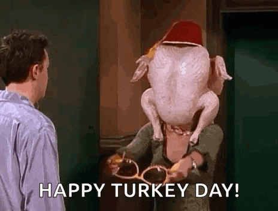

```{r setup, include=FALSE, echo = FALSE, warning = FALSE, message=FALSE}

library("tidyverse")
library("lubridate")
library("plotly")
library(readxl)
library(covdataplot)
library(magick)
library(extrafont)
library(sf)
library(ggmap)
library(gganimate)
library(gghighlight)
library(scales)
library(tidyquant)
library(glue)
library(widyr)
library(tidytext)
library(ggimage)


word_pairs <- readRDS("chatbot_word_pairs_top_10_clive.rds") 


```





"Clive", the chatbot featured on Economic Development's website, was launched on November 1st, 2024 for the purpose of quickly answering questions related to everything from how to open a business in Covington to finding available commercial property to incentives to required permits.  In the first three weeks of activity the chatbot has had 101 conversations and answered nearly 300 questions from the public. 

This chart shows the top 10 word pairs from the questions that Clive has answered.  The pairs are words that occur in consecutive sequence in a question. The majority of the questions have been about the Covington Central Riverfront (CCR) project, zoning permits, and available incentives.

*P.S., Clive wishes everyone a Happy Friendsgiving!*

```{r eval=TRUE, warning = FALSE, echo = FALSE, message = FALSE, fig.width = 7, fig.height = 6}


bigram_labels <- labs(title = "Popular Word Pairs from Clive Chatbot Questions",
                    subtitle = "Top 10 Pairs\n",
                    caption = "\nSource: City of Covington | Economic Development | CovData",
                    x = "Words", y = "Percent") 


chat_bigram_plot <- word_pairs |>
  ggplot(aes(x = fct_reorder(bigram, tf), y = tf))+
  geom_bar(fill = "green", stat = 'identity',position = "dodge", show.legend = FALSE)+
  #facet_wrap(~Employee_Name)+
  #scale_color_tq() +
  #scale_fill_tq() +
  covdata_theme(panel.background.fill = "covington.black", 
                plot.background.fill = "covington.black", 
                text.color = "covington.plain")+
  #theme_tq() +
  coord_flip() +
  scale_y_continuous(expand = expansion(mult = c(0, .1))) +
  geom_text(aes(label = scales::comma(tf)),  hjust= 1.1,  size = 3.5)+
  bigram_labels +
  geom_image(
    data = tibble(tf = 14, bigram = "favorite movie"),
    aes(image = "chat bot icon_CLIVE_Friendsgiving_1.png"),
    size = 0.35)

chat_bigram_plot


```


